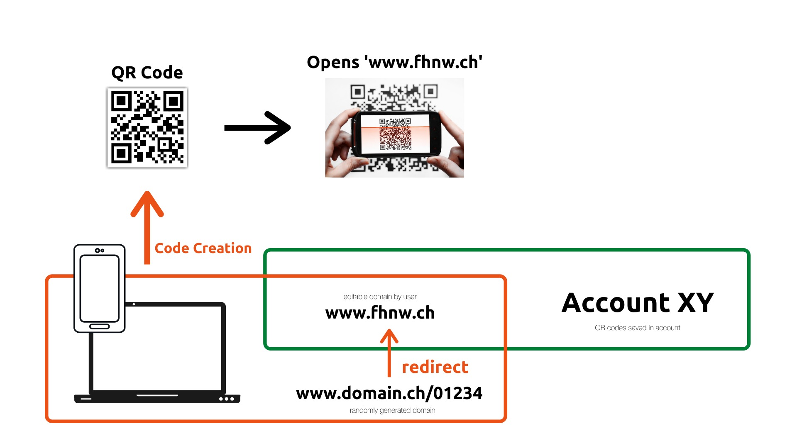
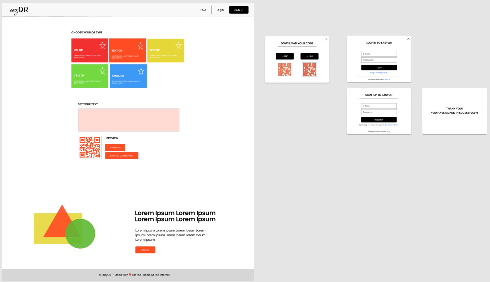

# easyQR - a QR-code generator and manager 
Student project - Creating a Web-Application based on Spring Boot.

See this video to get an overview of all functionalities: https://www.loom.com/share/02675cb716fa41ee9620117fc94e3f94

With this tool it is easy to generate QR-codes. The dashboard lets you manage all codes you have created if you are 
logged-in and have added it to your dashboard.  

One major feature is to create a QR-Code which can be assigned to a dynamic URL (only available if logged in). 
The QR-Code contains a static URL (the URL of the web-application) with an index added to it. 
When this specific URL is called, the client that scanned the QR-Code is then redirected to a defined URL. 
This defined URL can be changed in the backend (reason that the user has to be signed up and logged in).

The main functionalities of this application are:
- Create QR-code
- Create a user and edit the users settings / profile
- Edit the target of a QR-code that points to a website
- Add Codes to your dashboard
- Manage (edit and delete) entries on your dashboard

The application can be visited at https://easyqr.herokuapp.com

##  Implemented functionalities
Implemented are the following features:
  - Create a QR-Code (one of 5 different types)
  - Download the created QR-Code
  - Create an account and login
  - Add created QR-Codes to the personal Dashboard
  - Edit and delete QR-Codes of the type "redirect-url"
  - Delete QR-Codes of all types

## Stuff that could be a bug
  - We didn't manage to implement it correctly that images are saved in the DB. Images are saved in a predefined 
    location and the path is saved in the DB. 
    The problem is that with containerization, all the files are deleted if the container (dyno on heroku) is down.
  - The methodology in which the API functions (especially REST API) are implemented are rather incorrect. 
Only the delete API is working particularly with ID's. The other functions work with PathVariables such as 
    Username and QrCode-name (or similar).

    

## Technical documentation
For the web-application a Spring-Boot framework is used with Java 8 and PostgreSQL DB that is accessed with JPA.  

There are two domains:
  - EasyQrUser
  - EasyQrCode

## Implemented user stories:
1. As a [user], I want to have a Web app so that I can use it on my different
   mobile devices and desktop.
2. As a [user], I want to see a consistent visual appearance so that I can
   navigate easily, and it looks professional.
3. As a [user], I want to use list views so that I can explore and read my
   business data.
4. As a [user], I want to use edit and create views so that I can maintain my
   business data.
5. As a [user], I want to use the  permanent-delete functionality so that I can maintain my business data.
6. As a [user], I want to create an account so that I can get access to the
   Web app.
7. As a [user], I want to log-in so that I can authenticate myself.
8. As a [user], I want to edit my profile so that my data is stored securely.

## Not implemented
  - Groups: create a group and specify for each QR-Code what group can edit the element.

9. *As a [user], I want to share my business data so that I can give others
   read-only or editable access to my business data* - would have been implemented with user-groups

## Development iterations
First we developed an idea and the basic concept. This was the result of the first discussion:
  

The second part in the development was designing mockups. Based on the mockups, the frontend parts were designed in 
Bootstrap studio. 
